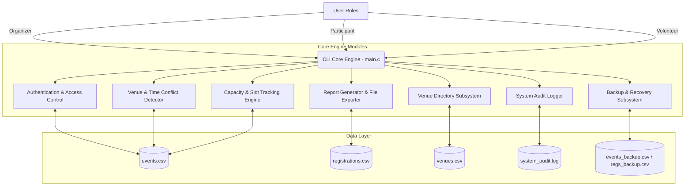
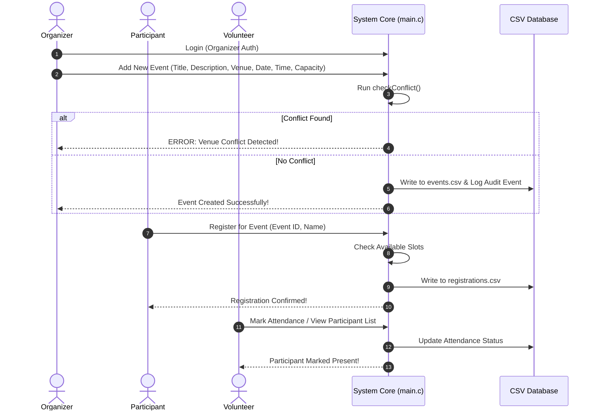

<div align="center">


# Daffodil International University (DIU)
### Capstone Project: Event Management System (`main.c`)


</div>

---

## 👥 Group Project Team Members & Module Responsibilities

| Member | Student ID | Implemented Functions & Module Responsibilities |
|---|---|---|
| **Pratik Barua** | `252-35-226` | • **Add/Update/Delete Events**: Create detailed event profiles including title, description, date, time, and venue.<br>• **Participant Registration**: Sign up for events with immediate confirmation.<br>• **Attendance Management**: Track and update participant attendance status.<br>• **Scheduling & Conflict Detection**: Monitor venue and time slots to identify and prevent double-booking. |
| **Umme Habiba Ayshi** | `252-35-298` | • **Venue Allocation & Directory Subsystem (`venues.csv`)**: Manage DIU venues, locations, and facilities.<br>• **Venue Occupancy Alerts**: Real-time slot status indicators (`[AVAILABLE]`, `[FEW SLOTS LEFT]`, `[FULL]`).<br>• **System Testing & Documentation Validation**. |
| **Moshiur Rahman** | `252-35-184` | • **Report Generation & Export (`event_summary_report.txt`)**: Produce detailed summary reports detailing registration numbers, attendance rates, and event status.<br>• **System Audit Logging (`system_audit.log`)**: Timestamped security & operation logging.<br>• **Data Backup & Restore Subsystem**. |

---

## 📌 Executive Summary

The **DIU Event Management System** is a lightweight, high-performance event planning, slot management, and registration engine built natively in C. Designed specifically for university department operations, it enforces role-based security, handles venue schedule conflicts, tracks real-time capacity, records participant check-ins, and generates analytical summaries.

---

## 🏗️ System Architecture

<div align="center">


</div>



---

## 🌟 Key Features & Functional Responsibility

| Module | Features & Capabilities | Primary Contributor | Functional Requirements |
|---|---|---|---|
| 🔐 **Authentication & Access** | Role-based dashboard routing (Organizer, Participant, Volunteer) with password check obfuscation | Pratik Barua | FR1, FR2, NFR6 |
| 📅 **Add/Update/Delete Events** | Create detailed event profiles including title, description, date, time, and venue | Pratik Barua | FR3, FR4, FR5 |
| 🎟️ **Participant Registration** | Allow users to sign up for specific events and receive immediate confirmation | Pratik Barua | FR7, FR12, FR18 |
| 📋 **Attendance Management** | Track and update the attendance status of registered participants | Pratik Barua | FR11, FR19 |
| 🚨 **Scheduling & Conflict Detection**| Monitor venue and time slots to identify and prevent double-booking | Pratik Barua | FR8 |
| 📍 **Venue Allocation & Directory** | Manage physical DIU locations, capacity caps, facilities (`venues.csv`), and occupancy alerts | Umme Habiba Ayshi | FR9, FR14 |
| 📊 **Report Generation & Export** | Produce and export summary reports detailing registration numbers, attendance rates, and status | Moshiur Rahman | FR13 |
| 📜 **System Audit Logging** | Track system actions with real-time timestamps into `system_audit.log` | Moshiur Rahman | NFR2, NFR3 |
| 💾 **Data Backup & Restore** | 1-click database duplication (`events_backup.csv`) and auto-backup on session logout | Moshiur Rahman | FR16, FR17 |

---

## 🔄 User Workflow Diagram



---

## 🚀 Getting Started

### Prerequisites
- **GCC Compiler**: `sudo apt install -y gcc`
- **Linux Environment**: (Ubuntu / Zorin / Debian / Fedora)

### Compilation & Execution

To build and run the project:
```bash
# Compile with Makefile
make

# Or compile manually with GCC
gcc -Wall main.c -o main

# Execute CLI System
./main
```

---

## 📁 Repository File Structure

```
capstone_DIU_Event_Management/
├── README.md               # System Documentation & Architecture Overview
├── .gitignore              # Git Ignore Rules for Compiled Executables
├── Makefile                # Build Script for C CLI Engine
├── main.c                  # CAPSTONE CORE: C Event Management Engine
├── events.csv              # Primary Events Storage File
├── registrations.csv       # Primary Registrations Storage File
├── venues.csv              # DIU Venue Directory & Capacity Allocations
├── system_audit.log        # Timestamped System Audit Logs
└── assets/
    ├── logo.png            # Minimalist Line-Art Emblem Logo
    └── architecture.png    # Minimalist Black & White Architecture Diagram
```

---

<div align="center">
  <b>Daffodil International University (DIU)</b> • Department of Software Engineering
</div>
