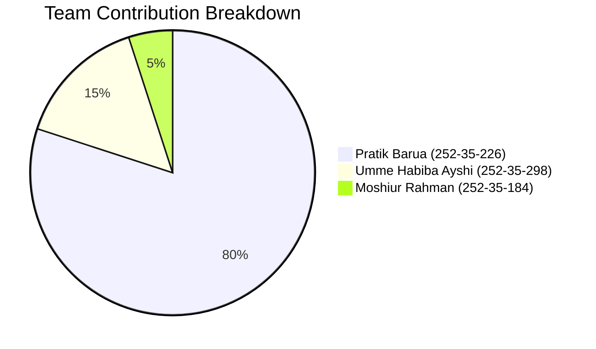
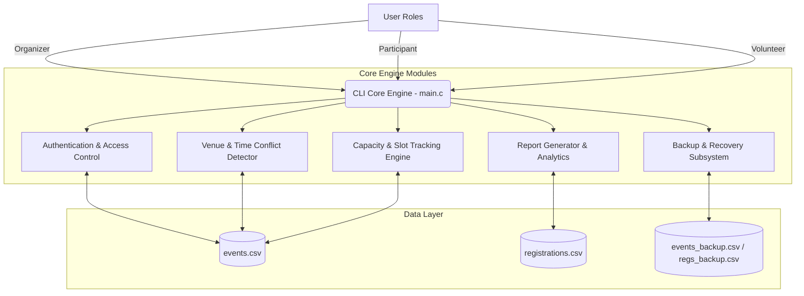
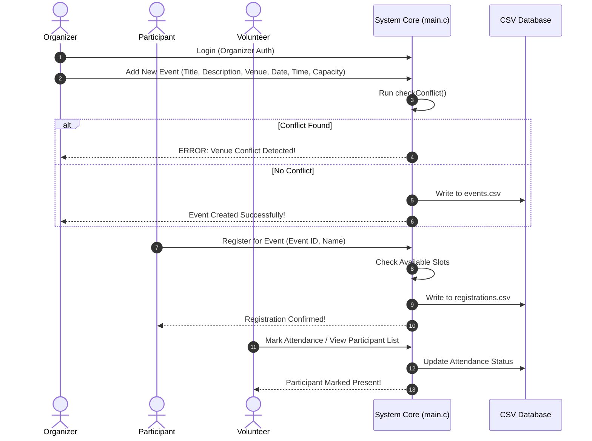

<div align="center">


# Daffodil International University (DIU)
### Capstone Project: Event Management System (`main.c`)


</div>

---

## 👥 Group Project Team Members

| Member | Student ID | Contribution Area | Contribution Ratio |
|---|---|---|---|
| **Pratik Barua** | `252-35-226` | CLI System Core (`main.c`), Conflict Algorithm, Data Structures, Build Config, README | **80%** |
| **Umme Habiba Ayshi** | `252-35-298` | System Testing, Functional Validation & Documentation | **15%** |
| **Moshiur Rahman** | `252-35-184` | Backup & Recovery Module (`manageBackups`) | **5%** |



---

## 📌 Executive Summary

The **DIU Event Management System** is a lightweight, high-performance event planning, slot management, and registration engine built natively in C. Designed specifically for university department operations, it enforces role-based security, handles venue schedule conflicts, tracks real-time capacity, records participant check-ins, and generates analytical summaries.

---

## 🏗️ System Architecture



---

## 🌟 Key Features

| Module | Features & Capabilities | Functional Requirements |
|---|---|---|
| 🔐 **Authentication** | Role-based dashboard routing (Organizer, Participant, Volunteer) with password check obfuscation | FR1, FR2, NFR6 |
| 📅 **Event Creation** | Add events with title, description, date, time, venue, category, and seating capacity | FR3 |
| 🚨 **Conflict Prevention** | Automated verification preventing two events at the same date, time, and venue | FR8 |
| 🎟️ **Registration System** | Real-time seat allocation, capacity validation, and confirmation generation | FR7, FR9, FR12 |
| 🔍 **Search & Filter** | Multi-attribute search (title, date, description) and filter (category, venue) | FR10, FR14 |
| 📋 **Attendance Check-In** | Volunteer & Organizer check-in module updating real-time attendance statistics | FR11 |
| 📋 **Participant List View** | Dedicated participant lookup per event ID displaying presence status and feedback | FR19 |
| 💬 **Participant Feedback** | Collect and tie participant review comments to specific event records | FR15 |
| 💾 **Backup & Restore** | 1-click database duplication (`events_backup.csv`) and fail-safe recovery | FR16, FR17 |

---

## 🔄 User Workflow Diagram



---

## 🚀 Getting Started

### Prerequisites
- **GCC Compiler**: `sudo apt install -y gcc`
- **Linux Environment**: (Ubuntu / Zorin / Debian / Fedora)

### Compilation & Execution

To build and run the project:
```bash
# Compile with Makefile
make

# Or compile manually with GCC
gcc -Wall main.c -o main

# Execute CLI System
./main
```

---

## 📁 Repository File Structure

```
capstone_DIU_Event_Management/
├── README.md               # System Documentation & Architecture Overview
├── .gitignore              # Git Ignore Rules for Compiled Executables
├── Makefile                # Build Script for C CLI Engine
├── main.c                  # CAPSTONE CORE: C Event Management Engine
├── events.csv              # Primary Events Storage File
├── registrations.csv       # Primary Registrations Storage File
└── assets/
    └── logo.png            # Minimalist Line-Art Emblem Logo
```

---

<div align="center">
  <b>Daffodil International University (DIU)</b> • Department of Computer Science & Engineering
</div>
